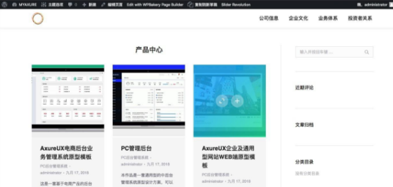
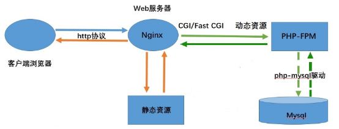
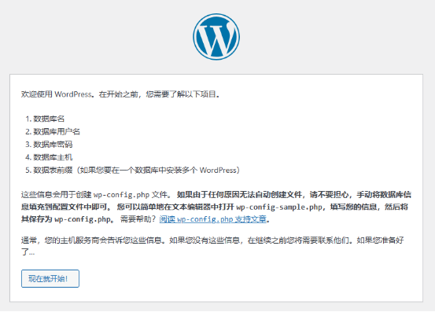
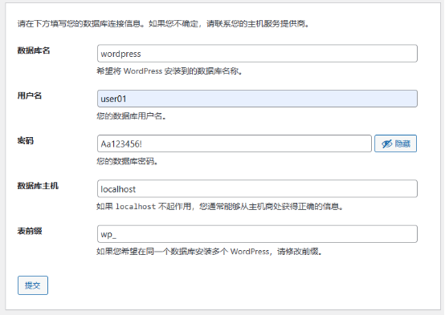
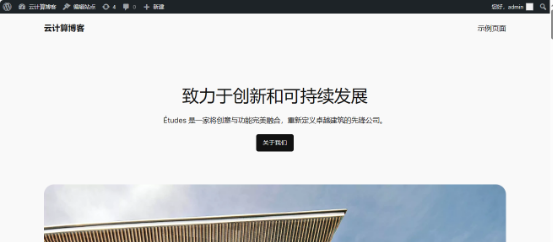

**开源CMS系统部署**

- **项目介绍：**

WordPress是一个功能强大的内容管理系统（CMS），它可以用于创建各种类型的网站，从个人博客到企业网站，从在线商店到社交网络等等。

WordPress 内容管理系统为全球35%的网站提供支持。鉴于目前有 17 亿个站点，并且还在增加，您可以算出每秒向网站访问者提供内容的WordPress网站的数量。

然而，问题是，当人们想到 WordPress 时，很多人仍然认为它只适用于 中小型企业网站 或博客。事实上，许多人认为流行的 CMS 不足以处理大公司、知名全球品牌，甚至世界最著名名人的个人网站。

案例：

- **项目技术栈：**

WordPress是使用[PHP](https://baike.baidu.com/item/PHP/9337?fromModule=lemma_inlink)语言开发的博客平台，用户可以在支持PHP和[MySQL](https://baike.baidu.com/item/MySQL/471251?fromModule=lemma_inlink)数据库的服务器上架设属于自己的网站。因此我们可以使用经典的LAMP或者LNMP架构进行部署，本项目我们选择使用LNMP架构。

`    `LNMP平台是高效稳定的Web应用平台，LNMP架构结合了**Linux**操作系统的稳定性、[**Nginx**](https://so.csdn.net/so/search?q=Nginx&spm=1001.2101.3001.7020)服务器的高性能、**MySQL**数据库的可靠性和**PHP**语言的灵活性，被广泛应用于Web开发和部署。

LNMP架构图：

- **项目实施**

开源博客平台wordpress部署

• 版本：wordpress-6.4.3

• 系统要求：我们推荐服务器运行PHP7.4或更高版本；数据库软件可采用MySQL5.7或更高版本，也可采用MariaDB10.3或更高版本。

1. **安装nginx**

   1\.停止原有web服务卸载yum安装的nginx

   2\.准备源码安装依赖的环境

   # yum install -y gcc pcre-devel zlib-devel

   3\.创建程序运行用户和组

   useradd  -M -s /sbin/nologin  nginx

   4\. 下载源码包

   wget http://nginx.org/download/nginx-1.19.7.tar.gz

   5\.解包

   tar -axf nginx-1.19.7.tar.gz

   6\.配置

   cd ~/nginx-1.19.7

   ./configure --prefix=/usr/local/nginx --user=nginx --group=nginx

   7\.编译安装

   make  &&  make install

   8\.启动服务

   /usr/local/nginx/sbin/nginx

   netstat -tunlp | grep nginx

   firewall-cmd --zone=public --add-port=80/tcp --permanent

   firewall-cmd --reload

   9\.路径优化

   vim /etc/profile.d/nginx.sh

   export PATH="/usr/local/nginx/sbin:$PATH"

   source /etc/profile #立即生效

   10\.启动服务测试访问：nginx

   **2）安装mysql8.0**

   # yum install -y https://repo.mysql.com/mysql80-community-release-el7-6.noarch.rpm

   #yum install -y mysql-community-client mysql-community-server

   #systemctl enable mysqld --now

   #firewall-cmd --permanent --zone=public --add-port=3306/tcp

   #firewall-cmd --reload

   设置密码：

   #root\_tmp\_password=`grep -o "A temporary password .\*" /var/log/mysqld.log | awk -F ': ' '{print $2}'`

   #mysqladmin -uroot -p$root\_tmp\_password password 'Aa123456!'

   如果需要远程访问：

   mysql> CREATE USER 'newuser'@'%' IDENTIFIED BY 'password';

   mysql> GRANT ALL PRIVILEGES ON \*.\* TO 'newuser'@'%' WITH GRANT OPTION;

   创建wordpress数据库：

   mysql>  create database wordpress;

   **3）安装php**

   #yum install epel-release

   #rpm -ivh http://rpms.famillecollet.com/enterprise/remi-release-7.rpm

   #yum --enablerepo=remi install php74-php php74-php-devel php74-php-fpm php74-php-gd php74-php-xml php74-php-sockets php74-php-session php74-php-snmp php74-php-mysql

   #/opt/remi/php74/root/usr/sbin/php-fpm

   **4）配置服务**

   1\.配置php-fpm

   php-fpm的配置文件为 /etc/opt/remi/php74/php-fpm.d/www.conf

   将 user 和 group 设置为 Nginx 用户和组：

   user = nginx

   group = nginx

   listen.owner = nginx

   listen.group = nginx

   如过需要跨主机通信：

   sed -i -r 's/^\s\*listen\s\*=.\*/listen = 0.0.0.0:9000/' /etc/php-fpm.d/www.conf

   sed -i -r 's/^\s\*listen.allowed\_clients\s\*=.\*/listen.allowed\_clients = 192.168.168.101/' /etc/php-fpm.d/www.conf

2. 配置nginx

   ....

   location / {

   `            `root   html;

   `            `index   index.php index.html index.htm;

   `        `}

   .....

   location ~ \.php$ {

   fastcgi\_pass   127.0.0.1:9000;           # 使用 TCP socket通信

   #fastcgi\_pass   192.168.168.102:9000;    # 使用 TCP socket 跨主机通信

   `    `fastcgi\_index  index.php;

   `    `fastcgi\_param  SCRIPT\_FILENAME  $document\_root$fastcgi\_script\_name;

   `    `include        fastcgi\_params;

   }

2. 测试php与nginx集成

   cat 1.php

   <?php

   `  `phpinfo();

   ?>

5. **部署wordpress源码**

   下载地址https://cn.wordpress.org/download/

   #tar -axf wordpress-6.4.3-zh\_CN.tar.gz

   #mv wordpress/\* /usr/local/nginx/html/

   访问服务器ip完成部署

   

   

   后台管理界面：

   

   前端访问界面：

   

5. **分离部署**

   将php-fpm、nginx、mysql部署到不同主机上
