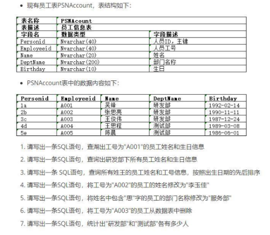
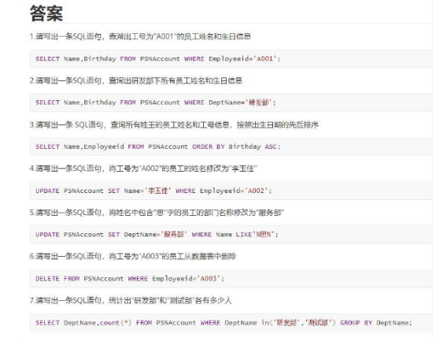
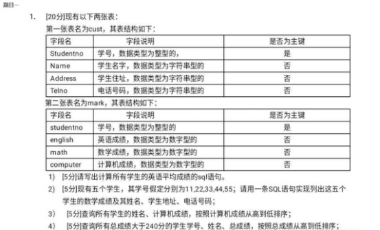
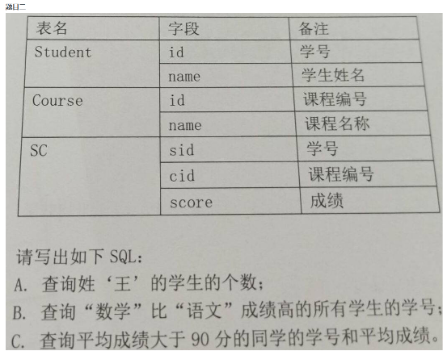


关系型与非关系型数据库的区别

`    `关系型数据库（如MySQL）基于表格结构，遵循ACID原则，支持SQL标准，提供事务处理能力，并且通常具有固定的模式和数据一致性保证。

`    `非关系型数据库（NoSQL）则更加灵活，可以适应不同的数据模型，比如键值对、文档、列族、图形数据库等，它们通常牺牲部分ACID特性以换取水平扩展能力和高性能。

什么是 SQL?SQL 有哪些功能?

答案: SQL 代表结构化查询语言，它是访问关系数据库的通用语言，支持数据的各种增删改查操作。SQL 语句可以分为以下 子类: 

DQL，数据查询语言。这个就是 SELECT 语句，用于查询数据库中的数据和信息。

DML，数据操作语言。包括 INSERT、UPDATE、DELETE 和 MERGE 语句，主要用于数据的增加、修改和删除。

DDL，数据定义语言。主要包括 CREATE、ALTER 和 DROP 语句，用于定义数据库中的对象，例如表和索引。

TCL，事务控制语言;主要包括 COMMIT、ROLLBACK 和 SAVEPOINT 语句，用于管理数据库的事务。

DCL，数据控制语言。主要包括 GRANT 和 REVOKE 语句，用于控制对象的访问权限

CHAR 和 VARCHAR 类型的区别?

答案: CAHR 是固定长度的字符串，如果输入的内容不够使用空格进行填充，通常用于存储固定长度的编码;VARCHAR 是 可变长度的字符串，通常用于存储姓名等长度不一致的数据。

什么是自增列?

答案:自增列(auto increment)，也称为标识列(identity column)，用于生成一个自动增长的数字。它的主要用途就是为 主键提供唯一值。

DROP TABLE 和 TRUNCATE TABLE 的区别?

答案: DROP TABLE 用于从数据库中删除表，包括表中的数据和表结构自身。同时还会删除与表相关的的所有对象，包括索 引、约束以及访问该表的授权。TRUNCATE TABLE 只是快速删除表中的所有数据，回收表占用的空间，但是会保留表的结构。

count(\*)与count(列名)的区别?

count(\*)包括了所有的列，相当于行数，在统计结果的时候，不会忽略列值为NULL

count(列名)只包括列名那一列，在统计结果的时候，会忽略列值为空（这里的空不是只空字符串或者 0，而是表示 null）的计数，即某个字段值为 NULL 时，不统计。

MySQL日志文件有哪些？分别介绍下作用？

错误日志（error log）：错误日志文件对MySQL的启动、运行、关闭过程进行了记录，能帮助定位MySQL问题。

慢查询日志（slow query log）：慢查询日志是用来记录执行时间超过 long\_query\_time 这个变量定义的时长的查询语句。通过慢查询日志，可以查找出哪些查询语句的执行效率很低，以便进行优化。

一般查询日志（general log）：一般查询日志记录了所有对MySQL数据库请求的信息，无论请求是否正确执行。

二进制日志（bin log）：关于二进制日志，它记录了数据库所有执行的 DDL和 DML 语句（除了数据查询语句 select、show 等），以事件形式记录并保存在二进制文件中。

还有两个 InnoDB 存储引擎特有的日志文件：

重做日志（redo log）：重做日志至关重要，因为它们记录了对于 InnoDB 存储引擎的事务日志。

回滚日志（undo log）：回滚日志同样也是InnoDB引擎提供的日志，顾名思义，回滚日志的作用就是对数据进行回滚。当事务对数据库进行修改，InnoDB引擎不仅会记录redo log，还会生成对应的undo log日志；如果事务执行失败或调用了rollback，导致事务需要回滚，就可以利用undo log中的信息将数据回滚到修改之前的样子。

主从复制原理了解吗？

master 数据写入，更新 binlog

master 创建一个 dump 线程（转存线程）向 slave 推送 binlog

slave连接到master的时候，会创建一个IO线程接收binlog，并记录到relay log中继日志中

slave 再开启一个 sql 线程读取 relay log 事件并在 slave 执行，完成同步slave 记录自己的 binglog

MySQL中InnoDB和MyISAM引擎的区别

`    `InnoDB：

`      `支持事务处理（ACID特性）。

`      `实现行级锁定，提高并发性能。

`      `内置支持外键约束。

`      `使用聚簇索引，主键组织表数据。

`    `MyISAM：

`      `不支持事务。

`      `使用表级锁定，可能导致并发写入时的性能瓶颈。

`      `无事务和外键支持。

`      `存储表的总行数，适合读密集型应用。

`      `使用非聚簇索引。

3\. InnoDB为什么推荐使用自增ID作为主键

`    `自增ID能够确保主键值唯一且单调递增，有利于插入新记录时保持B+树索引有序性，减少页分裂和数据迁移。

`    `在聚簇索引中，主键值决定了行数据在磁盘上的物理存储顺序，使用自增ID可以避免随机插入导致的I/O碎片化。

4\. ACID是什么

`    `Atomicity（原子性）：事务内的所有操作要么全部成功，要么全部失败。

`    `Consistency（一致性）：事务完成后，数据库从一个一致状态转换到另一个一致状态。

`    `Isolation（隔离性）：并发执行的事务之间互不影响，仿佛是串行执行。

`    `Durability（持久性）：一旦事务提交，其结果即使在系统故障后也必须是永久的。

5\. 聚集索引与非聚集索引的区别

`    `聚集索引：索引的叶子节点直接包含行数据，索引的顺序决定了数据行的物理存储顺序（对于InnoDB，默认主键索引是聚集索引）。

`    `非聚集索引：索引的叶子节点包含指向数据行的指针，索引顺序与数据行在硬盘上的物理顺序无关。

6\. 针对高并发插入优化MySQL

`    `使用自增主键快速插入。

`    `适当调整`innodb\_buffer\_pool\_size`提高缓存效率。

`    `分区表策略，根据业务特点分区，分散写入压力。

`    `减少不必要的事务阻塞，合理设置事务隔离级别。

`    `对频繁插入的表避免过多或复杂的索引。

7\. 分库分表设计

`    `根据业务规模和访问负载，进行垂直切分（按表结构划分）或水平切分（按数据范围划分）。

`    `使用中间件进行分布式管理，例如分片规则、路由策略等。

8. 什么是主键索引和唯一索引的区别？

   主键索引：每一行数据都有唯一的主键值，不允许为空，一张表只能有一个主键索引，它是聚簇索引，决定了数据在磁盘上的物理存储顺序。

   唯一索引：索引列的值必须唯一，但允许有空值，一张表可以有多个唯一索引，它不是聚簇索引，仅仅用来保证索引列的唯一性，不决定数据的物理存储顺序

8. MySQL中的JOIN操作有哪些类型？

   INNER JOIN：返回两个表中存在匹配项的所有行。

   LEFT JOIN/RIGHT JOIN：返回左表或右表的所有行，另一侧如果有匹配则显示数据，否则显示NULL。

8. 什么是MySQL的索引，以及何时应创建索引？

   索引是数据库中为了加快数据检索速度而构建的一种数据结构，它可以大大加快查询的速度，尤其是在处理大量数据时。

   应该在以下情况下创建索引：

   经常用于搜索的列。

   连接操作中使用的列。

   WHERE子句中经常出现的列。

   ORDER BY和GROUP BY语句中涉及到的列。

   注意：虽然索引有助于加速查询，但是也会占用额外的空间，并可能减慢写操作，因此需要权衡利弊。

   简述MySQL中的事务是什么？

   事务是数据库操作的基本单位，它是一系列数据库操作的集合，这些操作要么全部执行成功，要么全部不执行。事务具有ACID四个特性：原子性（Atomicity）、一致性（Consistency）、隔离性（Isolation）和持久性（Durability）。

   什么是MySQL中的视图？

   视图是从一个或多个表中派生出的虚拟表，它并不实际存储数据，而是存储查询定义。视图简化了查询操作，同时可以隐藏底层表的复杂性，并且可以在一定程度上保护数据的安全性。

   如何备份和恢复MySQL数据库？

   备份：可以使用mysqldump命令或者Percona Xtrabackup工具进行逻辑备份或物理备份。

   恢复：通过mysql客户端加载SQL文件（逻辑备份）或复制备份文件到数据目录（物理备份）。

   索引不适合哪些场景

   数据量少的不适合加索引

   更新比较频繁的也不适合加索引

   区分度低的字段不适合加索引（如性别）

   什么是幻读，脏读，不可重复读呢？

   事务A、B交替执行，事务A被事务B干扰到了，因为事务A读取到事务B未提交的数据,这就是「脏读」

   在一个事务范围内，两个相同的查询，读取同一条记录，却返回了不同的数据，这就是「不可重复读」。

   事务A查询一个范围的结果集，另一个并发事务B往这个范围中插入/删除了数据，并静悄悄地提交，然后事务A再次查询相同的范围，两次读取得到的结果集不一样了，这就是「幻读」。

   SQL 约束有哪几种呢？

   NOT NULL: 约束字段的内容一定不能为NULL。

   UNIQUE: 约束字段唯一性，一个表允许有多个 Unique 约束。

   PRIMARY KEY: 约束字段唯一，不可重复，一个表只允许存在一个。

   FOREIGN KEY: 用于预防破坏表之间连接的动作，也能防止非法数据插入外键。

   UNION和UNION ALL的区别？

   Union：对两个结果集进行并集操作，不包括重复行，同时进行默认规则的排序；Union All：对两个结果集进行并集操作，包括重复行，不进行排序；UNION的效率高于UNION ALL

   解释子查询以及它们的用途。

   子查询是嵌套在其他SQL查询中的查询。子查询可以返回一组值，通常在WHERE或HAVING子句中使用。子查询允许你进行更复杂的查询，比如选择只满足另一个查询结果条件的记录。

   **笔试题：**

   

   

   

   **解答：**

   1、select avg(eglish) from mark;

   2、select mark.math,cust.Name,cust.Address,cust.Telno from mark join cust on mark.studentno = cust.Studentno where cust.studentno in (11,22,33,44,55);

   3、select cust.Name ,mark.computer form cust join mark on cust.Studentno = mark.studentno order by mark.computer desc;

   4、select cust.Studentno,cust.Name,english + math + computer total

   from cust join mark on cust.Studentno = mark.studentno

   having total > 240

   order by total desc;

   

   解答：
   A. select count(‘王姓学生’) from Student where Student.name like ‘王%’;
   B. select Student.id from SC,Student,Course where Student.id = SC.sid and SC.cid = Course.id group by Student.id having (select SC.score from course join SC on course.id = SC.cid where Course.name = ‘数学’) > (select SC.score from course join SC on course.id = SC.cid where Course.name = ‘语文’);
   C. select Student.id,avg(sores) from Student join SC on Student.id = SC.sid group by Student.id having avg(sores) > 90;

