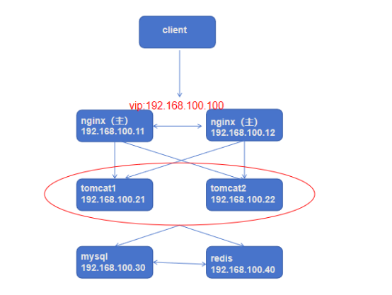

**前后端分离项目高可用部署**

`                             `**RuoYi后台管理系统**

- **项目介绍**

**大型高可用架构示例：**

**本次项目部署拓扑图：**

- **项目部署：**

环境要求：

JDK >= 1.8 (推荐1.8版本)

Mysql >= 5.7.0 (推荐5.7版本)

Maven >= 3.0

1. 拓扑规划

   1\.项目结构/技术栈

   后端框架:使用java语言开发，(Springboot+mybatsiveplus)

   前端框架：Vue 3

   数据库:支持MySql/0racle/SqLServer数据库

   使用redis做缓存

 

   |**节点**|**地址**|**软件包安装**|
   | :-: | :-: | :-: |
   |前端|192\.168.100.11|Nginx+keepalived|
   |前端|192\.168.100.12|Nginx+keepalived|
   |后端|192\.168.100.21|Java+maven|
   |后端|192\.168.100.22|Java+maven|
   |数据库|192\.168.0.214|Mysql|
   |缓存|192\.168.0.215|Redis|

1. 项目源码下载

   获取ruoyi的项目源代码：

   （内外环境所有节点关闭防火墙和selinux）

   yum -y install git

   git clone https://gitee.com/y\_project/RuoYi-Vue.git

   

1. 数据库安装配置

   配置mysql的yum源
   vim /etc/yum.repos.d/mysql57.repo
   [mysql57]
   name=mysql57
   baseurl=https://mirrors.tuna.tsinghua.edu.cn/mysql/yum/mysql-5.7-community-el7-x86\_64
   enabled=1
   gpgcheck=0

1) 安装mysql社区版：
   yum -y install mysql-community-server mysql-community-client
   启动mysql：
   systemctl start mysqld
1) 修改密码后登录

   `  `创建ry数据库：
   create database ry character set utf8 collate  utf8\_general\_ci;

   grant all on \*.\* to 'root'@'%' identified by 'Aa123456!' with grant option;
   flush privileges;

   3）导入数据文件

   

1. **redis安装部署**

   下载redis的源码包：
   yum -y install wget //下载wget命令
   wget http://download.redis.io/releases/redis-4.0.9.tar.gz
   解压缩到指定目录：
   tar -xf redis-4.0.9.tar.gz -C /usr/local/
   修改redis的解压目录名：
   mv /usr/local/redis-4.0.9/ /usr/local/redis
   安装源码安装redis的环境依赖
   yum install -y gcc make
   编译redis：
   cd /usr/local/redis/
   make

   修改redis的配置文件：
   vim redis.conf
   修改内容如下
   bind 192.168.0.215  //设置监听的ip,设置为redis服务器的ip
   port 6379       //设置监听的端口
   daemonize yes   //设置redis服务器在后台运行

   后台运行
   /usr/local/redis/src/redis-server redis.conf &

   查看监听的端口：
   yum -y install net-tools
   netstat -lntp | grep redis

1. **前端部署**
1. 部署nginx，yum、源码都可以
   yum -y install nginx

   2）配置前端打包环境

   下载node打包环境：

   #wget https://nodejs.org/dist/v16.9.1/node-v16.9.1-linux-x64.tar.xz

   #tar -xf node-v16.9.1-linux-x64.tar.xz -C /usr/local

   #mv /usr/local/node-v16.9.1-linux-x64/ /usr/local/node

   echo 'export PATH=$PATH:/usr/local/node/bin' >> /etc/profile.d/node.sh

   source /etc/profile

   node -v

   3）前端打包

   cd RuoYi-Vue/ruoyi-ui

   修改node源

   #这一步是修改为国内的阿里云源，因为如果不修改，默认是从国外下载，下载速

   度会很慢，甚至下载不了

   ` `npm config set registry https://registry.npmmirror.com

   查看

   ` `npm config get registry https://registry.npmmirror.com/

   安装依赖

   npm install 

   打包正式环境

   打包完成后，会生成一个dist文件夹，只要这个dist就可以把前端运行起来了

   npm run build:prod  

   cp -r ruoyi-ui/dist/\* /usr/share/nginx/html/

   4）配置nginx

   vim /etc/nginx/conf.d/default.conf
   **upstream ruoyi{
   `     `server 192.168.100.21:8080 weight=1;
   `     `server 192.168.100.22:8080 weight=1;
   }**
   server {
   `    `listen       80;
   `    `server\_name  localhost;

   `    `access\_log  /var/log/nginx/host.access.log  main;

   `    `location / {
   `        `root   /usr/share/nginx/html;
   `        `try\_files $uri $uri/ /index.html;
   `        `index  index.html index.htm;
   `    `}

   `    `location /prod-api/ {
   `        `**proxy\_pass http://ruoyi/;**
   `        `proxy\_set\_header Host $http\_host;
   `        `proxy\_set\_header X-Real-IP $remote\_addr;
   `        `proxy\_set\_header x-Forwarded-For $proxy\_add\_x\_forwarded\_for;
   `    `}

   location /prod-api/这个是做什么呢：

   这个其实我们一般看不到，是前端给后端通信的，只要url里面包含 /prod-

   api/，就会帮我们转给后端， proxy\_pass http://localhost:8080/这个

   就是转到http://localhost:8080/了，因为我们的java后端项目绑定了8080

   端口，所以就能够接收到了

5. 安装部署keepalived

   # yum -y install keepalived

   **Nginx（主）：**

   # vi /etc/keepalived/keepalived.conf

   vrrp\_script chk\_http\_port {
   `    `script "/usr/local/src/nginx\_check.sh"#脚本路径
   `    `interval 2 #（检测脚本执行的间隔）;每隔2s检查一次
   `    `weight 2 #设置服务器权重
   }

   #虚拟ip的配置
   vrrp\_instance VI\_1 {
   `        `state MASTER # Master为Master；Salve为BACKUP
   `        `interface ens33 #网卡；可以用ip addr 看网卡名
   `        `virtual\_router\_id 51 # 主、备机的 virtual\_router\_id 必须相同
   `        `priority 100 # 主、备机取不同的优先级，主机值较大，备份机值较小
   `        `advert\_int 1 #每1s发送一次心跳
   `        `authentication {
   `        `auth\_type PASS
   `        `auth\_pass 1111
   `        `}
   `        `virtual\_ipaddress {
   `        `192.168.100.100/24 # VRRP H 虚拟ip地址,多台keepalived绑定一个ip；必须同一网段
   `        `}
   `        `track\_script {			#指定要检测的脚本	
   `             `chk\_http\_port 	#指定我们定义的要检查的脚本名称
   `        `}
   }
   **Nginx备：**

   vrrp\_script chk\_http\_port {
   `    `script "/usr/local/src/nginx\_check.sh"#脚本路径
   `    `interval 2 #（检测脚本执行的间隔）;每隔2s检查一次
   `    `weight 2 #设置服务器权重
   }

   #虚拟ip的配置
   vrrp\_instance VI\_1 {
   `        `state BACKUP 
   `        `interface ens33 
   `        `virtual\_router\_id 51 
   `        `priority 90 
   `        `advert\_int 1 
   `        `authentication {
   `        `auth\_type PASS
   `        `auth\_pass 1111
   `        `}
   `        `virtual\_ipaddress {
   `        `192.168.100.100/24 
   `        `}
   `        `track\_script {			#指定要检测的脚本	
   `             `chk\_http\_port 	#指定我们定义的要检查的脚本名称
   `        `}
   准备脚本：
   
   #cat /usr/local/src/nginx\_check.sh
   
   #!/bin/bash
   A=`ps -C nginx --no-header |wc -l`
   if [ $A -eq 0 ];then
   `    `systemctl start nginx
   `    `sleep 2
   `    `if [ `ps -C nginx --no-header |wc -l` -eq 0 ];then
   `        `killall keepalived 
   `    `fi
   fi
   # chmod a+x /usr/local/src/nginx\_check.sh 
   
   # systemctl restart keepalived

   **六、后端部署**

   所有节点做相同操作：

1) 安装maven

   # yum -y install  java-11-openjdk

   #wget https://mirrors.tuna.tsinghua.edu.cn/apache/maven/maven-3/3.9.5/binaries/apache-maven-3.9.5-bin.tar.gz --no-check-certificate

   #tar -xf apache-maven-3.9.5-bin.tar.gz -C /usr/local/

   #mv /usr/local/apache-maven-3.9.5/ /usr/local/maven

   #echo 'export PATH=$PATH:/usr/local/maven/bin' >> /etc/profile.d/mvn.sh

   #source /etc/profile

   #mvn -version

   3）后端代码的打包：

   cd /root/RuoYi-Vue

   3.1）修改redis的配置文件

   vim ruoyi-admin/src/main/resources/application.yml

   

   3.2）修改mysql配置信息

   vim ruoyi-admin/src/main/resources/application-druid.yml

   

   配置mysql的服务器ip端口号，ssl认证关闭，用户密码

   4）后端打包

   cd RuoYi-Vue/

   mvn install 

   mvn clean package

   #ll RuoYi-Vue/ruoyi-admin/target

   #打包成功后，上面的路径里面就多了一个jar包，如这个项目是ruoyi-

   admin.jar(不同的项目路径也不一样)

   运行：java -jar ruoyi-admin.jar

   

   后台运行：

   nohup java -jar ruoyi-admin.jar > /dev/null 2>&1 &

   日志存放路径：/home/ruoyi/logs

   七、测试验收

   登录vip地址，默认用户admin，密码admin123

   

   
