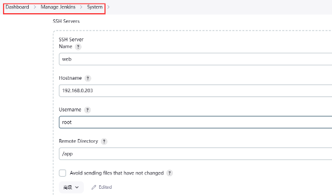

**自动化部署java项目实战**

**项目简介：**

在现代软件开发流程中，持续集成、自动化测试与部署是提高开发效率、确保软件质量的关键环节。本次基于Java项目，实现持续集成持续部署的自动化流程。

**流程示意图：**

**具体流程图：**

**项目实施：(以ruoyi源码演示)**

1. **服务器部署规划**

   |主机|IP地址|应用部署|
   | - | - | - |
   |Client（开发环境）|192\.168.0.204|Git|
   |Gitlab（远程代码库）|192\.168.0.215|Gitlab|
   |Jenkins（集成工具）|192\.168.0.202|Java、jenkins、maven|
   |Web（应用服务器）|192\.168.0.203|Java（tomcat）|

1. **安装部署**

   **2.1 部署gitlab**

   测试环境：关闭firewalld、selinux

   1）下载安装

   以下是官方源安装命令，经常会连接不上

   curl -s https://packages.gitlab.com/install/repositories/gitlab/gitlab-ce/script.rpm.sh | sudo bash

   手动创建清华源：

   cat > /etc/yum.repos.d/gitlab-ce.repo << EOF

   [gitlab-ce]

   name=Gitlab CE Repository

   baseurl=https://mirrors.tuna.tsinghua.edu.cn/gitlab-ce/yum/el\$releasever/

   gpgcheck=0

   enabled=1

   EOF

   

   #yum -y install gitlab-ce

   

   2）修改配置：

   vi /etc/gitlab/gitlab.rb

   external\_url 'http://192.168.0.215'  #指定本机地址

   重新配置初始化服务：

   gitlab-ctl reconfigure

   3）登录创建本次项目的代码库（ruoyi-test）

   管理员账号：root

   查看初始密码：

   cat /etc/gitlab/initial\_root\_password

   

   **2.2 项目源码准备**

   1）开发者电脑安装git工具

   ` `# mkdir -p /www &cd /www

   #yum install -y git
   
   #git config --global user.name "admin"
   
   git config --global user.email "12345678@qq.com”

2) 克隆若依源码（本次选择前后端不分离）

   #git clone https://gitee.com/y\_project/RuoYi.git

2) 推送源码到ruoyi-test仓库

   #git clone http: //192.168.0.215/root/ruoyi-test.git

   #rm -rf /www/RuoYi/{.git,.github}

   #cp -r /www/RuoYi/\* /www/ruoyi-test/

   #cd /www/ruoyi-test/

   #git add .

   #git commit -m “first commit”

   git push origin main

   

   **2.3 jenkins安装部署**

   1）安装java、jenkins、软件包

   #yum install -y git java-11-openjdk-devel

   #yum install -R 1 -y https://mirrors.ustc.edu.cn/jenkins/redhat/jenkins-2.426-1.1.noarch.rpm

   #systemctl daemon-reload

   #systemctl enable jenkins

   systemctl start jenkins

   登录：Jenkins Web 控制台，执行安装向导（http://Jenkins服务器IP地址:8080）

2. 安装工具maven

   #wget https://mirrors.tuna.tsinghua.edu.cn/apache/maven/maven-3/3.9.5/binaries/apache-maven-3.9.5-bin.tar.gz --no-check-certificate

   #tar -axf apache-maven-3.9.5-bin.tar.gz -C /usr/local/

   mv /usr/local/apache-maven-3.9.5/ /usr/local/maven

   echo 'export PATH=$PATH:/usr/local/maven/bin' >> /etc/profile.d/mvn.sh

   #source /etc/profile

   mvn -version

2. jenkins添加maven工具，安装Maven Integration插件

   

   4）安装配置Publish Over SSH插件

   

1. **创建jenkins自动发布项目**

   **3.1 创建自由风格项目**

   

   

   

   **3.2 创建流水线项目**

   流水线示例：

   pipeline {

   `  `agent any

   `  `stages {

   `    `stage('获取代码') {

   `      `steps {

   `        `git url: 'http://192.168.0.215/root/ruoyi-test.git', branch: 'main', credentialsId: 'd443052f-17a6-4d22-9c83-f059bd4bb0a6'

   `      `}

   `    `}

    

   `    `stage('任务构建') {

   `      `steps {

   `        `sh '''

   `        `pwd

   `        `/usr/local/maven/bin/mvn install

   `        `/usr/local/maven/bin/mvn package

   `        `'''

   `      `}

   `    `}

    

   `    `stage('部署') {

   `      `steps {

   `        `sshPublisher(publishers: [sshPublisherDesc(configName: 'web', 

   `        `transfers: [sshTransfer(cleanRemote: false, excludes: '', 

   `        `execCommand: 'cd /app; nohup java -jar \*.jar > /dev/null 2>&1 &', 

   `        `execTimeout: 120000, flatten: false, makeEmptyDirs: false, noDefaultExcludes: false, 

   `        `patternSeparator: '[, ]+', remoteDirectory: '/', remoteDirectorySDF: false, 

   `        `removePrefix: 'ruoyi-admin/target/', sourceFiles: 'ruoyi-admin/target/\*.jar')], 

   `        `usePromotionTimestamp: false, useWorkspaceInPromotion: false, verbose: false)])

   `      `}

   `    `}

   `  `}

   }

   **3.3 配置触发器实现自动构建**

   1）安装gitlab插件，配置触发器

   

   

2. 配置gitlab的webhook

   

   

   
