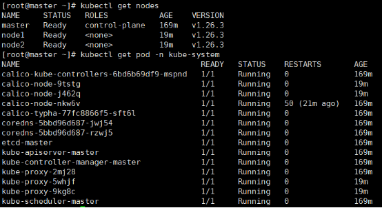

**自动化工具ansible实战：一键部署k8s集群**

1. **知识回顾**

   **安装：**

   #wget -O /etc/yum.repos.d/epel-7.repo  https://mirrors.aliyun.com/repo/epel-7.repo

   #yum -y install ansible

   **Ansible常用模块用法：**

   模块用法查看帮助信息：

   ansible-doc  模块名称   -s （概要信息）

   ansible-doc -l  #列出所有的模块

   ad-hoc命令语法：

   ansible  主机  -m  模块名 -a  ‘模块参数’

   1\.setup模块  收集被控端facts设备信息  （各种硬件配置信息）

   2\.ping模块  测试连通性

   3\.user模块  用户管理

   参数：

   create\_home：是否创建家目录

   shell：指定登录的shell    /sbin/nologin 不可登录

   name :指定用户名

   state：状态（具体的操作：absent（删除）、present（创建））

   remove：删除家目录 （state=absent时才可用）

   4\.group模块  组管理

   state：状态（具体的操作：absent（删除）、present（创建））

   name :指定组名

   5\.file模块  文件管理

   state：touch创建或更新文件   directory创建或更新目录   absent（删除） file（更新）

   owner：文件所有者

   group：属组

   mode：权限

   path：目标路径  touch /tmp/1.txt

   6\.acl模块  访问控制模块

   state：absent（撤销） present（授予） query（查询）

   path：文件路径（作用对象）

   etype：acl对象类型  user（用户）  group（组）

   entity：具体对象 （用户名或者组名，与etype对应）

   permissions：具体设置的权限

   7、copy模块  （主控端--》被控端）

   src：原文件路径

   dest：目标文件路径

   mode：指定权限

   owner：指定复制后的文件的属主

   content：替代src，也就是将一段内容作为原，将这个内容直接写入到目标文件中

   8、fetch 将被控端的文件，拉取到主控端

   src：原文件路径

   dest：目标文件路径

   flat：设置采用扁平的名称空间  （是否保留源文件完整的路径:主机名/路径/文件名）

   9、firewalld 管理被控端的firewalld防火墙

   state: enabled(表示add添加规则)、disabled（表示remove删除规则） absent、present（表示删除添加区域）

   port：指定端口 端口/协议

   service：指定服务名称

   permanent：是否永久生效  （默认临时生效）

   immediate：是否立即生效

   10、selinux 管理被动端的SELinux策略和状态

   state: enforcing强制、permissive非强制但警告、disabled禁用

   11、yum模块

   参数：

   name：指定软件包名称

   state：present安装（默认）  absent（删除）    latest  （更新到最新的）

   安装多个软件包时：name=软件包1，软件包2....

   12、service模块与systemd模块  ：服务管理模块

   name：指定服务的名称

   enabled：指定服务是否开机自启动 ：yes（开机自启）no（禁止开机自启）

   state：指定服务最后的状态 started stopped reloaded restarted

   13、command模块:在被控端执行单个命令  （默认模块）

   ansible web(组名)  -m command  -a  '要执行的命令'                            

   注意：不识别变量及特殊符号：比如管道符

   14、shell模块：在被控端执行单个命令或多个命令

   与command模块类似，但是支持更复杂的命令及特殊符号比如管道符

   执行多条命令：  命令1；命令2...

   15、script模块

   ansible web -m script -a /tmp/1.sh  （脚本的绝对路径）

   16、template模块：拷贝模板文件到被控端 (一般用来拷贝配置文件)

   src：源文件（一般是模板文件 \*.j2）

   dest:目标位置

   copy模块无法识别文件内容中的变量，template可以。

   17、cron模块

   \*              \*         \*          \*           \*

   minute  hour    day  month   weekday

   job参数：具体执行的命令

   state：present创建     absent删除

   18、unarchive模块

   src：源文件（压缩包）

   dest：目标路径 （解压后）

1. **实战——playbook部署k8s集群**

   先梳理一下搭建 k8s 环境的关键步骤：

   1、所有节点配置 k8s 环境

   2、master 节点安装k8s核心组件软件包、初始化集群、安装网络插件

   3、node 节点安装k8s核心组件软件包，并执行 join 到主节点的命令

   所以 ansible-playbook 里面的 roles 可以按步骤分成3个role来执行任务。

   **2.1 准备role的目录结构**

   #ansible-galaxy init *rolename*  初始化role，生成目录结构

   生成三个角色：init-env、masterrole、workerrole

   需准备的文件：

   内存参数修改文件：k8s.conf

   时间同步服务配置文件模板：chrony.conf.j2 （使用变量master\_ip）	

   Containerd服务配置文件模块：config.toml.j2	

   Calico网络插件yaml文件：calico.yaml

   #/etc/ansible/roles

   

   

   

   **2.2 主机清单文件**

   

   **2.3 创建role：init-env**

   #cat init-env/tasks/main.yml

   ---

   - name: 配置hosts文件

   `  `copy: src=/etc/hosts dest=/etc/hosts

   - name: 关闭防火墙

   `  `service: name=firewalld state=stopped enabled=no

   - name: 关闭selinux

   `  `selinux: state=disabled

   - name: 关闭交换分区

   `  `shell: swapoff -a;sed -ri 's/.\*swap.\*/#&/' /etc/fstab

   - name: 添加网络模块

   `  `shell: modprobe -a overlay br\_netfilter

   - name: 修改内核参数

   `  `copy: src=k8s.conf dest=/etc/sysctl.d/k8s.conf

   - name: 刷新内核参数

   `  `shell: sysctl --system

   - name: 准备yum源

   `  `copy: 

   `    `src: "{{ item }}" 

   `    `dest: /etc/yum.repos.d/

   `  `with\_items:

   `    `- /etc/yum.repos.d/epel-7.repo

   `    `- /etc/yum.repos.d/docker-ce.repo

   `    `- /etc/yum.repos.d/kubernetes.repo

   **2.4 创建role：masterrole**

   #cat masterrole/tasks/main.yml

   ---

   - name: 时间同步服务

   `  `template: src=chrony.conf.j2 dest=/etc/chrony.conf

   - name: 重启服务

   `  `service: name=chronyd state=restarted enabled=yes

   - name: 安装containerd

   `  `yum: name=containerd state=present

   - name: 启动服务

   `  `service: name=containerd state=started enabled=yes

   - name: 配置containerd

   `  `template: src=config.toml.j2 dest=/etc/containerd/config.toml

   `  `notify: restart containerd

   - name: 安装核心组件

   `  `yum: state=present name=kubelet-1.26.3,kubeadm-1.26.3,kubectl-1.26.3

   - name: kubelet 服务

   `  `service: name=kubelet enabled=yes

   - name: 初始化集群

   `  `shell: |

   `     `kubeadm init \

   `     `--apiserver-advertise-address={{ master\_ip }} \

   `     `--image-repository registry.aliyuncs.com/google\_containers \

   `     `--kubernetes-version v1.26.3 \

   `     `--service-cidr=10.96.0.0/12 \

   `     `--pod-network-cidr=10.244.0.0/16 \

   `     `--ignore-preflight-errors=all

   `  `tags: t1

   - name: kubeconfig

   `  `shell: mkdir -p $HOME/.kube && cp -i /etc/kubernetes/admin.conf $HOME/.kube/config && chown $(id -u):$(id -g) $HOME/.kube/config 

   `  `tags: t2

   - name: 下载网络插件

   `  `copy: src=calico.yaml dest=/root/

   - name: 安装网络插件

   `  `shell: kubectl apply -f /root/calico.yaml

   #cat masterrole/handlers/main.yml

   ---

   - name: restart containerd

   `  `systemd: name=containerd state=restarted

   **2.5 创建role：workerrole**

   #cat workerrole/tasks/main.yml

   ---

   - name: 时间同步服务

   `  `template: src=chrony.conf.j2 dest=/etc/chrony.conf

   - name: 重启服务

   `  `service: name=chronyd state=restarted enabled=yes

   - name: 安装containerd

   `  `yum: name=containerd state=present

   - name: 启动服务

   `  `service: name=containerd state=started enabled=yes

   - name: 配置containerd

   `  `copy: src=config.toml dest=/etc/containerd/

   `  `notify: restart containerd

   - name: 安装核心组件

   `  `yum: state=present name=kubelet-1.26.3,kubeadm-1.26.3,kubectl-1.26.3

   - name: kubelet 服务

   `  `service: name=kubelet enabled=yes

   - name: Get the join command from master

   `  `shell: kubeadm token create --print-join-command

   `  `register: join\_command\_output

   `  `delegate\_to: master

   `  `tags: t3

   - name: join the kubernetes cluster

   `  `shell: "{{ join\_command\_output.stdout }}"

   `  `tags: t4

   #cat workerrole/handlers/main.yml

   ---

   - name: restart containerd

   `  `systemd: name=containerd state=restarted

   **2.6 创建playbook部署k8s**

   **#cat install-k8s.yaml** 

   ---

   - hosts: all

   `  `remote\_user: root

   `  `roles:

   `   `- init-env

   - hosts: master

   `  `remote\_user: root

   `  `roles:

   `   `- masterrole

   - hosts: worker

   `  `remote\_user: root

   `  `roles:

   `   `- workerrole

   运行剧本：

   #ansible-playbook  install-k8s.yaml

   

   验证集群部署完成：

   
