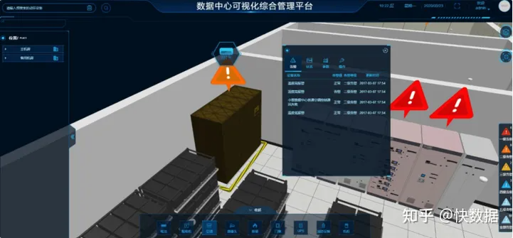

## IDC机房运维要做好哪些事情？

### 1、软件维护

软件设备可分为操作系统软件、典型应用软件（如：数据库软件、中间件软件等）、业务应用软件等

维护：常用应用软件的安装、调试、管理、更新、升级、故障检测及排除。

操作系统的调试、管理、更新，升级，故障检测及排除。

建立常用应用软件及驱动程序库。（视客户情况而定）

### 2、硬件维护

1）、硬件设备包括：网络设备、安全设备、主机设备、存储设备等

- 维护：计算机硬件设备的维护、保养、更新、升级、故障检测及排除。
- 对于需要更换的设备，提供设备选型建议及市场参考价格，并可代为购买（设备采购费用另计）。
- 建立电脑硬件配置档案，实行标准化管理。（视客户情况而定）

2）、网络交换机维护提供网络交换机的调试、故障诊断、日常维护保养、更换升级建议。对于突发的紧急硬件故障可以提供匹配的设备进行临时替代，保证用户网络的正常运转。

3）、路由器维护提供用户端路由器的调试、故障诊断、日常维护保养、更换升级建议。对于突发的紧急硬件故障可以提供匹配的设备进行临时替代，保证用户网络的正常运转。

### 3、安全维护

安装、管理、维护客户端计算机的病毒防护系统。

培训用户计算机病毒的防护知识以及防病毒软件的使用，建立用户的防病毒意识。升级、更新、优化用户已有的病毒防治系统。

定期提供病毒检测、告警及最新预防措施。

提供紧急病毒故障处理服务，对突发的新计算机病毒进行及时响应。

对用户的网络防病毒系统进行维护，升级版本，更新病毒库从而确保网络、系统及数据资料的安全。

### 4、物理环境维护

#### 综合布线系统维护

利用专业测试仪器提供对铜缆、光纤的布线故障检测处理。

对现有综合布线系统

中存在的缺陷、问题提供合理化改造或升级方案，并可提供专业水平的工程施工(工程费用另计)。

#### 主机、存储系统运维服务

主机、存储系统的运维服务包括：主机、存储设备的日常监控，设备的运行状态监控，故障处理，操作系统维护，补丁升级等内容。

#### 设备的增加

内存和硬盘的增加是服务器最常见的，安装的应用软件、资源库越来越多，服务器需要更多的内存和硬盘容量。增加内存前需要认定与服务器原有的内存的兼容性，最好是同一品牌的规格的内存。如果是服务器专用的ECC内存，则必须选用相同的内存，普通的SDRAM内存

与ECC内存在同一台服务器上使用很可能会引起系统严重出错。在增加硬盘以前，需要认定服务器是否有空余的硬盘支架、硬盘接口和电源接口，还有主板是否支持这种容量的硬盘。尤其需要注意，防止买来了设备却无法使用。

#### 设备的卸载和更换

卸载和更换设备时的问题不大，需要注意的是有许多品牌服务器机箱的设计比较特殊，需要特殊的工具或机关才能打开，在卸机箱盖的时候，需要仔细看说明书，不要强行拆卸。另外，必须在完全断电、服务器接地良好的情况下进行，即使是支持热插拔的设备也是如此，以防止静电对设备造成损坏。

除尘尘土是服务器最大的杀手，因此需要定期给服务器除尘。尤其是在炎热的夏季，对于服务器来说，灰尘甚至是致命的。除尘方法与普通PC除尘方法相同，尤其要注意的是电源的除尘。



### 5、其它维护

机房环境检查就是对机房的温度、湿度、照明、防鼠、防水、防尘、消防、卫生、门窗的关闭进行检查，主要通过检查以下设备或项目去完成：

#### 1）机房空调

- 检查空调是否正常运行、制冷温度是否在规定范围内
- 检查空调设备断电后再通电的自动投运状况
- 检查空调是否有漏水现象※检查空调电源插头是否稳固、是否出现老化现象
- 检查空调设备卫生情况
- 填写巡检记录

#### 2）照明设备

- 检查照明设备是否都能正常运行、照明光度是否足够
- 检查机房事故照明断电后的工作情况
- 检查照明设备是否出现老化迹象
- 检查照明设备的控制开关是否能正常使用、灵敏度
- 填写巡检记录

#### 3）消防设备

- 检查消防设备合格证、是否通过安全定检
- 消防设备是否配备足够
- 消防设备是否完好（外观）
- 检查机房消防系统是否能正常运行
- 清洁消防设备
- 填写巡检记录

#### 4）抽湿机

- 检查机房抽湿机是否正常运行
- 检查机房抽湿机设定的湿度是否在规定范围内
- 填写巡检记录

#### 5）机房防鼠

- 检查机房所有与外界有联系的孔洞是否已严密封堵
- 检查机房门窗是否已关闭
- 检查机房门的防鼠板
- 是否已装上并安装稳密
- 填写巡检记录


#### 6）机房防水、防尘

- 检查机房空调是否有漏水现象
- 检查机房墙壁是否有渗水现象
- 检查机房门窗是否已关闭
- 填写巡检记录

#### 7）机房卫生

- 检查机房是否有垃圾、杂物
- 清洁门窗、地柜；整洁办公用品，清洁地面
- 负责施工后机房地面清洁工作
- 填写巡检记录

#### 8）电池

- 检查蓄电池外观完好性
- 检查蓄电池是否有变型、渗液等状况※清洁蓄电池
- 填写巡检记录

#### 9）防雷设备

- 检查防雷设备运行是否正常，能否实现防雷功能
- 检查、测试设备运行的相关参数是否正常并记录
- 检查设备的外观完好性
- 检查设备是否出现老化迹象
- 检查防雷设备接线是否牢固，线缆是否出现老化迹象
- 清洁防雷设备
- 填写巡检记录

#### 10）UPS系统

​     UPS主机一般是智能型的，它对环境温度要求不高，但要求室内清洁卫生否则灰尘遇潮湿会引起主机工作紊乱；主机中的参数在使用中不能随意改变；在断电时，应避免带负载启动UPS电源，应先关掉负载，等UPS启动后再开启负载，否则会有多负载的冲击电流和供电电流造成UPS电源瞬间过载，严重时会损坏变换器；不能让UPS电源经常处于满载或过载。

第一，蓄电池的维护及注意事项

​     尽管使用的是[免维护蓄电池](https://www.zhihu.com/search?q=免维护蓄电池&search_source=Entity&hybrid_search_source=Entity&hybrid_search_extra={"sourceType"%3A"answer"%2C"sourceId"%3A3178496037})


## 机房信息资产统计

IDC数据机房资产统计应包含在日常运行维护中，帮助我们对用户现有的信息资产情况进行了解，更好的提供系统的运行维护服务。

统计内容包括：

- 硬件设备型号、数量、版本等信息统计记录；
- 软件产品型号、版本和补丁等信息统计记录；
- 网络结构、网络路由、网络IP地址统计记录；
- 综合布线系统结构图
- 其它附属设备的统计记录；

## **IDC机房智能化管理**

远程智能控制管理软件

可实现对IDC数据机房的实时监控、故障检测、批量备份、一键开关机重启、一键安装应用软件、远程分配资源、机房空调控制等。

机房、机柜内每台设备都会在远程只能控制管理软件上面一对一映射，可进行全方位远程监测和控制管理，远程智能控制软件

## **IDC机房值班方案**

### 1、用户现场技术人员值守

​      IDC数据机房现场应安排技术人员值守，保证网络的实时连通和可用，保障接入交换机、汇聚交换机和核心交换机

的正常运转。现场值守的技术人员每天记录网络交换机的端口是否可以正常使用，网络的转发和路由是否正常进行，交换机的性能检测，进行整体网络性能评估，针对网络的利用率进行优化并提出网络扩容和优化的建议。

​     现场值守人员还进行安全设备的日常运行状态的监控，对各种安全设备的日志检查，对重点事件进行记录，对安全事件的产生原因进行判断和解决，及时发现问题，防患于未然。

​     同时能够对设备的运行数据进行记录，形成报表进行统计分析，便于进行网络系统的分析和故障的提前预知。具体记录的数据包括：

- 配置数据
- 性能数据
- 故障数据

### 2、现场日常巡检

​     现场日常巡检需要对设备及网络进行全面检查的服务项目，通过该巡检，可最大可能地发现存在的隐患，保障设备稳定运行。同时，将有针对性地提出预警及解决建议，使客户能够提早预防，最大限度降低运营风险。

巡检包括的内容如下：


## **机房应急预案**

系统运维应急方案是对中断或严重影响业务的故障，如宕机、数据丢失、业务中断等，进行快速响应和处理，在最短时间内恢复业务系统，将损失降到最低。在系统维护过程中，突发事件的出现将是很难完全避免的，针对这种情况，公司应设计完善的突发事件应急策略。

​     系统巡检人员要定期规范检查各硬件设备的运转情况和应用软件运行情况，同时做好日常的数据增量备份和定期全备份。对发现的问题在报各级负责人的同时，要协调相关资源分析问题根源，确定解决方案和临时解决措施，避免造成更大的影响。问题得到稳定或彻底解决后，要形成问题汇报，避免以后类似重大紧急情况的发生

​      对发现的问题在报负责人的同时，要协调相关资源分析问题根源，确定解决方案和临时解决措施，避免造成更大的影响。问题得到稳定或彻底解决后，要形成问题汇报，避免以后类似重大紧急情况的发生。

​    技术支持工程师，需根据长期的机房工作经验，建立常用知识库，其中包括多种常见技术故障和突发事件的应急策略。当获悉出现突发事件时，技术支持人员可以立即从知识库中获取相应的应急策略，并综合用户方的具体情况，给出相关解决方案，然后在第一时间以电话、邮件支持或现场服务的方式帮助用户解决问题，尽最大努力减小突发事件对用户日常应用的影响。

数据中心基础设施应急演练，应围绕各项工作的目标要求，增强应急演练工作的计划性和主动性，坚决贯彻“12个有”：即各项应急演练工作开展之前要“有目标、有计划、有要求”，应急演练工作开展之中要“有人抓、有人管、有落实”，“有制度、有流程、有手段”，应急演练工作完成之后要“有总结、有考核、有提升”。


数据中心运维监控管理平台能够全方位的帮助网络运维部门提高整体网络运行的健康度，降低各项业务服务等待的时间，有效的记录各类问题的发生原因和处理过程、处理结果，能够详细科学的统计查询网管运维部门的工作业绩和价值，更加合理的安排人力资源，能够满足网络其他业务部门对网络服务水平的要求，真正提高这些业务部门对网络服务的满意度。

## 机房运维管理制度和流程

运维工程师高压线:ADC机房中所有已加电的设备未经允许一律不许操作在有运营设备的区域操作时，未经允许，一律不准碰到运营设备。
禁止未经授权的情况下对操作系统外任何应用程序、数据库等软件操作。
禁止泄漏我公司IDC机房任何敏感信息(包含但不仅限与网络架构、带宽、IP、服务器数量/型号、网络设备数量/型号等)。
禁止在没有授权的情况下擅自操作、移动、搬迁IDC设备
包括存放在IDC机房的备件)。


## idc机房安全隐患有哪些？


## 系统连接方式

Windows的主流远程登陆方式是:微软系统自带的远程桌面连接工县

Linux 的主流远程登陆方式是ssh远程登陆工具,常见的有,shell,PUTTY或securecrt软件

## 如何做好IDC机房的维护

### 1.机房环境控制

定期对设备进行除尘、清理，调整安保摄像头清晰度，防止由于机器运转、静电等因素将尘土吸入监控设备内部。同时检查机房通风、散热、净尘、供电、架空防静电地板等设施。机房室内温度应控制在5℃-35℃，相对湿度应控制在30%-85%。

### 2.机房空调维护

检查空调运行是否正常，换风设备运转是否正常。从视镜观察制冷剂液面，看是否缺少制冷剂。检查空调压缩机高、低压保护开关、干燥过滤器及其他附件。

### 3. UPS及蓄电池维护

根据实际情况进行电池核对性容量测试；进行电池组充放电维护及调整充电电流，确保电池组正常工作；检查记录输出波形、谐波含量、零地电压；查清各参数是否配置正确；定期进行UPS功能测试，如UPS同市电的切换试验。

### 4. 消防设备维护

检查火警探测器、手动报警按钮、火灾警报装置外观及试验报警功能；检查火灾警报控制器的自检、消音、复位功能及主备用电源切换功能。

### 5. 电路维护

镇流器、灯管及时更换，开关更换；线头氧化处理，标签巡查更换；供电线路绝缘检查，防止意外短路。

### 6. 基础维护

静电地板清洗清洁，地面除尘；缝隙调整，损坏更换；接地电阻测试；主接地点除锈、接头紧固；防雷器检查；接地线触点防氧化加固。

### 7. 机房管理体系

完善机房运维规范，优化机房运维管理体系，技术维护人员24小时及时响应。

IDC机房承载着服务器的各种事项，服务器上架、下架、处理故障等等。因此要建立健全的运维体系，保障IDC机房的平稳健康运营。

## 列举做网线时，568A或568B任一种线序

RJ45连插头与双绞线端接有T568A或T568B两种结构。

1、568A线序：绿白—1，绿—2，橙白—3，蓝—4，蓝白—5， 橙—6，棕白—7，棕—8

2、568B线序：橙白—1，橙—2，绿白—3，蓝—4，蓝白—5， 绿—6，棕白—7，棕—8


## 简述流量攻击和 CC 攻击的区别

流量攻击包括 DD0S 攻击、D0S 攻击，通过发送大流量进行攻击
DDOS 攻击包括:TCP SYN 泛洪攻击UDP SYN 泛洪攻击ICMP flood?攻击等
DOS 攻击包括:Ping of Death(死亡之 ping,基于 IP 的攻击)
流量攻击一般为 syn 或者 tcp 、udp 协议的攻击是发送垃圾数据包或者畸形数据包来堵塞带宽或者可以理解为消耗带宽资源，就好比马桶赌了冲不下去，这样也就达到了攻击的目的
CC 攻击不会占用太多流量(这里的流量指的是带宽资源)。CC攻击是占用你服务器的 CPU，当你服务器 CPU 接近 100%时，4你的服务器就无法处理其他访问数据，用户就无法进入你的网站了。

## 用户访问www.baidu.com时DNS的解析过程：

在浏览器中输入www.baidu.com之后，系统会检查本地解析hosts文件是否存在域名映射，如果存在，则域名解析到此完成。

如果本地hosts文件不存在映射关系，则会查询本地DNS缓存，如果存在，则域名解析完成。

如果本地DNS缓存没有命中，则查找本地DNS服务器，如果存在，则域名到此解析完成。

如果以上解析都失败了，本地DNS服务器会把请求发至根DNS服务器，根DNS服务器收到请求后会返回一个负责该顶级域名服务器的IP（com顶级域名服务器）。本地DNS服务器收到IP后，将会请求这个IP对应的服务器，就这样逐层查找（com顶级域名服务器---baidu.com域名服务器），直至找到www.baidu.com主机。

本地DNS服务器查找到后，缓存后将IP地址传给请求主机。

## IDC机房宽带突然从平时100M增加到400M，请你分析问题可能原因所在，并给出解决方法

(1)可能遭受DDOS攻击(写一个预防DDOS的脚本)

(2)内部的服务器中毒,大量外发流量(内部运维规范、制度)

(3)网站的元素被盗连,在门户页面被推广导致大量流量产生(网站的基本优化)

(4)用户访问量剧增

## 在网络排错中，你经常会用到的操作命令的作用：

```bash
ping 查看网络是否互通
netstat 一个监控TCP/IP网络的非常有用的工具，它可以显示路由表、实际的网络连接以及每一个网络接
口设备的状态信息。
nbtstat 用于查看在TCP/IP协议之上运行NetBIOS服务的统计数据，并可以查看本地远程计算机上的
NetBIOS名称列表。
net
telnet 查看端口是否互通
ipconfig 显示IP地址
```

## 网站出现200,302,400,404,500,502,503是什么意思？怎么排查和解决？

200 请求已成功，请求所希望的响应头或数据体将随此响应返回。

302 请求的资源现在临时从不同的 URI 响应请求。

400 1、语义有误，当前请求无法被服务器理解。除非进行修改，否则客户端不应该重复提交这个请求。


2、请求参数有误。

404 请求失败，请求所希望得到的资源未被在服务器上发现。

500 服务器遇到了一个未曾预料的状况，导致了它无法完成对请求的处理。一般来说，这个问题都会在服务器的程序码出错时出现。

502 作为网关或者代理工作的服务器尝试执行请求时，从上游服务器接收到无效的响应。

503 由于临时的服务器维护或者过载，服务器当前无法处理请求。

400是客户端问题 50是服务端问题

## http和https有什么区别？

http协议：是超文本传输协议，信息是明文传输。如果攻击者截取了Web浏览器和网站服务器之间的传输报文，就可以直接读懂其中的信息。

https协议：是具有安全性的ssl加密传输协议，为浏览器和服务器之间的通信加密，确保数据传输的安全。

## 简述raid0、raid1、raid5三种工作模式的工作原理及特点

raid0:条带卷，利用率100%，相对读写速率最快，相对安全性差。数据随机存入到阵列中的一个磁盘上。同时从2块磁盘读数据；读速度与raid1相差不多；

raid1:镜像卷，使用率50%，相对读写速率一般,相对安全性高。最少2块磁盘组成，数据同时存入到两块磁盘上。同时从2块磁盘读数据；写速度会比raid0慢；

raid5:带奇偶校验的镜像卷，相对读写速率较快，相对安全性高可以添加热被磁盘作为冗余

## 软链接和硬链接的区别：

硬链接不会创建新的inode，只是给源文件多加了一个文件名 软链接创建新的inode，相当于重新创建了一个文件

硬链接不能跨分区 软链接可以跨分区 硬链接删除源文件后，另一个文件还能用 软链接删除源文件后，链接文件不能再使用

## 系统安全加固

1.密码策略 修改系统的密码策略

- 1）经常修改密码
- 2）使用一些特殊的字符和密码的长度增加密码的难度
- 3）不要随便告诉他人密码

2.权限ugo锁定系统中不必要的系统用户和组 锁定下列用户，锁定之前备份/etc/passwd和/etc/shadow文件 禁用无关的组 禁止root用户远程登录

3.预防flood攻击linux中预防SYNflood.在/etc/sysctl.conf文件中添加net.ipv4.tcp_syncookies=1

4.加固TCP/IP协议设置/etc/sysctl.conf文件相应权限

5.默认权限与umask不要修改正确的umask值022

6.做任何修改文件的动作先备份再做操作

## 如何查看当前**linux**系统的状态，如**CPU**使用，内存使用，磁盘情况

可以使用top命令分析CPU使用，内存使用，负载等情况

可以使用free查看内存整体的使用情况

可以使用cat/proc/meminfo查看内存更详细的情况

### 1. 查看CPU使用情况

[参考](https://baijiahao.baidu.com/s?id=1790297638454542880&wfr=spider&for=pc)

在Linux系统中，可以使用top、htop、mpstat和sar命令查看CPU的占用率。这些命令提供了实时或历史数据，包括用户空间程序、系统内核、空闲时间等。其中，top和htop提供了进程列表，mpstat显示每个CPU的详细信息，sar提供系统性能的历史数据

### 2. 查看内存使用情况

[参考](https://www.cnblogs.com/liulianzhen99/articles/17631189.html)

### 3.查看磁盘情况

[参考](https://blog.csdn.net/2202_76106540/article/details/133740257)

## 一台Linux系统初始化环境后需要做一些什么安全工作？

1.更改密码

- 系统安装完成后，首先要做的就是更改root用户以及其他所有预设账户的密码，确保其强度符合安全标准

2.开启防火墙，关闭 SElinux

- 启用并配置防火墙，比如在Ubuntu/Debian上使用UFW，在RHEL/CentOS上使用firewalld，只开放必要的端口和服务给外部访问。

3.设置SSH安全策略：

- 修改SSH服务器配置（如`/etc/ssh/sshd_config`），禁止root直接登录，启用公钥认证而非密码登录，修改默认端口号以防止暴力破解

4.时间同步：

- 安装并启动NTP服务来保持系统时间和网络时间同步，确保日志记录和其他依赖时间戳的操作准确性。

5.用户和权限管理：

- 创建非root用户进行日常管理操作，避免滥用root权限。
- 对敏感文件和目录设置合适的权限，避免不必要的读写执行权限

6.SELinux或AppArmor配置（可选）：

- 根据具体需求启用并配置SELinux或AppArmor增强型安全模块。

7.日志审计与监控：

- 设置系统日志rotate策略，确保日志不会填满磁盘空间。
- 安装并配置日志分析工具（如Logwatch、Auditd等）进行定期审查和告警。

8.主机入侵检测系统（HIDS）：

- 安装和配置像AIDE这样的主机入侵检测系统，用于监控文件系统的完整性。

9.备份策略：

- 制定数据备份计划，确保关键数据得到及时备份，并验证备份的有效性

10.安装 fail2ban 这种防止 SSH 暴力破击的软件

11.可以安装 VPN 等软件，只允许连接 VPN 到服务器上

## Linux 系统优化中必会用到的一些命令

top：  用于实时查看系统的各项指标，如 CPU 占用率、内存占用率等。
vmstat： 查看系统虚拟内存、CPU 等性能数据的命令，可以用来分析系统的瓶颈。
iostat：  查看系统 I/O 的情况，包括硬盘、CD-ROM、网络文件系统等的读写速度、繁忙情况等。
sar：  系统性能分析工具，可以用来定期收集系统的各项指标，生成报表，以便分析系统的性能状况。
netstat： 查看网络连接状态和统计数据，例如当前连接数、传输速率等。
tcpdump： 抓包工具，用于捕获网络数据包并进行分析，以便定位网络问题。
ps： 查看进程状态的命令，可以用来查看进程占用的 CPU、内存、线程等资源情况。
top、htop、glances： 三个监控工具，都可以用来实时监控系统的各项指标，如 CPU 占用率、内存占用率、磁盘使用情况等。
free： 查看系统内存使用情况的命令，可以查看内存的空闲、使用、缓存等情况。
sysctl： 用于动态地配置内核参数，可以对系统的网络、存储、性能等方面进行优化

## 系统巡检案例

> 定时系统巡检(定时输出系统基本信息) 写入到/tmp/sys.log中.
>
> - ip地址信息(ip地址)  
>
> - 主机名信息(主机名)
>
> - 负载信息(0 0 0)
>
> - 内存信息(内存多大,用了多少,剩余多少)
>
> - cpu信息(核心数)
>
> - 磁盘信息(磁盘使用多少,剩余多少)
>
> - 进程信息(一共多少进程,几个运行,几个挂起,几个僵尸) 
>
> - 基础要求: 直接写出对应的命令
>
> - 进阶要求: 精确取出索要的内容. 

```bash
[root@local ~]$ cat > sys-info.sh <<'EOF'
#desc: get sys basic info
ip=`hostname -I`
hostname=`hostname`
load=`uptime |sed 's#^.*users,##g'`
mem_total=`free -h |awk 'NR==2{print $2}'`
mem_used=`free -h |awk 'NR==2{print $3}'`
mem_ava=` free -h |awk 'NR==2{print $NF}'`
cpus=`lscpu |awk 'NR==4{print $2}'`
root_used=` df -h|awk '$NF=="/" {print $(NF-1)}'`
process=`top -bn1 |awk 'NR==2'`
#使用变量(输出变量内容)
echo "ip地址信息: $ip "
echo "主机名信息: $hostname"
echo "负载信息: $load"
echo "内存信息: $mem_total $mem_used $mem_ava"
echo "cpu个数: $cpus"
echo "磁盘信息根分区使用率: $root_used"
echo "进程信息: $process"
EOF
```

## TCP的三次握手机制?

[参考(opens new window)](https://zhuanlan.zhihu.com/p/591865232)

- 1️⃣客户端发出建立连接请求: **SYN建立连接请求** . 发出seq的随机数(seq=100).
- 2️⃣服务端收到客户端请求: **ACK(确认),SYN(与客户端建立连接)** , 发出ack=seq+1(101),seq=随 机(666)
- 3️⃣客户端收到服务端请求与确认: **发出ACK确认建立连接** , 发出 ack=seq+1(667) seq=ack(101)
- 4️⃣到此,连接建立,开始传输数据.


## 四次挥手的过程：

- 1️⃣ 客户端: 发出断开连接请求: FIN断开连接请求,seq=随机数996
- 2️⃣ 服务端: 收到客户端请求,确认: ACK确认断开, seq=随机数(9) ack=seq+1(997)
- 3️⃣ 服务端: 向客户端发出断开连接请求,FIN断开连接请求, seq=随机数(9) ack=seq+1(997)
- 4️⃣ 客户端: 确认收到请求,断开连接, ACK确认收到请求, seq=997 ack=seq+1(10)
- 5️⃣ 连接断开


## 如何对系统性能优化？

1. 监控系统性能：使用监控工具对系统进行监控，收集系统的各项指标数据，例如 CPU、内存、磁盘、网络等。通过分析这些数据，可以了解系统的运行状况，发现性能瓶颈。
2. 分析性能瓶颈：根据监控数据分析，找出系统的性能瓶颈。比如，通过查看 CPU 利用率高的进程，可以确定是哪个进程导致了 CPU 瓶颈；通过查看磁盘 I/O 的情况，可以确定是否需要升级硬盘，或者增加磁盘容量等。
3. 制定优化方案：根据性能瓶颈的分析结果，制定相应的优化方案。比如，如果是 CPU 瓶颈，可以考虑升级 CPU 或者增加节点数等；如果是内存瓶颈，可以考虑增加内存，或者优化程序，减少内存使用等。
4. 实施优化方案：根据制定的优化方案，对系统进行相应的优化。比如，如果是升级硬件，需要采购新的硬件并安装配置；如果是优化程序，需要修改程序代码并进行测试等。
5. 测试和验证：对优化后的系统进行测试和验证，确保性能指标达到预期。比如，如果是 CPU 瓶颈，需要测试 CPU 利用率是否下降；如果是内存瓶颈，需要测试内存占用是否下降。
6. 持续监控和优化：优化完成后，需要持续进行监控，观察系统的性能状况，并进行必要的优化和调整，以确保系统的性能和稳定性

## Linux有几种安装软件的方式

1.rpm安装

2.yum安装

3.编译安装

## 请问当用户反馈网站访问慢，如何处理？

### 有哪些方面的因素会导致网站网站访问慢？

1、服务器出口带宽不够用，本身服务器购买的出口带宽比较小。

一旦并发量大的话，就会造成分给每个用户的出口带宽就小，访问速度自然就会慢。跨运营商网络导致带宽缩减。例如，公司网站放在电信的网络上，那么客户这边对接是长城宽带或联通，这也可能导致带宽的缩减。

2、服务器负载过大，导致响应不过来

可以从两个方面入手分析：分析系统负载，使用 w 命令或者 uptime 命令查看系统负载。如果负载很高，则使用 top 命令查看 CPU ，MEM 等占用情况，要么是 CPU 繁忙，要么是内存不够。

如果这二者都正常，再去使用 sar 命令分析网卡流量，分析是不是遭到了攻击。一旦分析出问题的原因，采取对应的措施解决，如决定要不要杀死一些进程，或者禁止一些访问等。

3、数据库瓶颈 如果慢查询比较多。

那么就要开发人员或 DBA 协助进行 SQL 语句的优化。如果数据库响应慢，考虑可以加一个数据库缓存，如 Redis 等。然后，也可以搭建 MySQL 主从，一台 MySQL 服务器负责写，其他几台从数据库负责读。

4、网站开发代码没有优化好 

例如 SQL 语句没有优化，导致数据库读写相当耗时。- 针对网站访问慢，

### 怎么去排查？

1、首先要确定是用户端还是服务端的问题。当接到用户反馈访问慢，那边自己立即访问网站看看，如果自己这边访问快，基本断定是用户端问题，就需要耐心跟客户解释，协助客户解决问题。不要上来就看服务端的问题。一定要从源头开始，逐步逐步往下。

2、如果访问也慢，那么可以利用浏览器的调试功能，看看加载那一项数据消耗时间过多，是图片加载慢，还是某些数据加载慢。

3、针对服务器负载情况。查看服务器硬件(网络、CPU、内存)的消耗情况。如果是购买的云主机，比如阿里云，可以登录阿里云平台提供各方面的监控，比如 CPU、内存、带宽的使用情况。

4、如果发现硬件资源消耗都不高，那么就需要通过查日志，比如看看 MySQL慢查询的日志，看看是不是某条 SQL 语句查询慢，导致网站访问慢。

### \- 怎么去解决？

1、如果是出口带宽问题，那么久申请加大出口带宽。

2、如果慢查询比较多，那么就要开发人员或 DBA 协助进行 SQL 语句的优化。

3、如果数据库响应慢，考虑可以加一个数据库缓存，如 Redis 等等。然后也可以搭建MySQL 主从，一台 MySQL 服务器负责写，其他几台从数据库负责读。

4、申请购买 CDN 服务，加载用户的访问。

5、如果访问还比较慢，那就需要从整体架构上进行优化咯。做到专角色专用，多台服务器提供同一个服务。